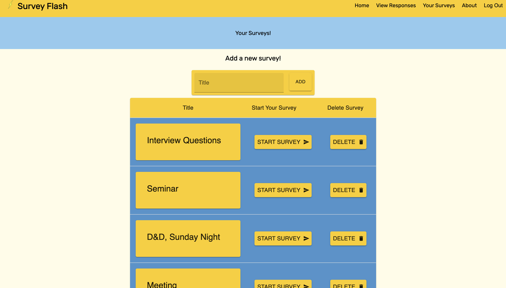
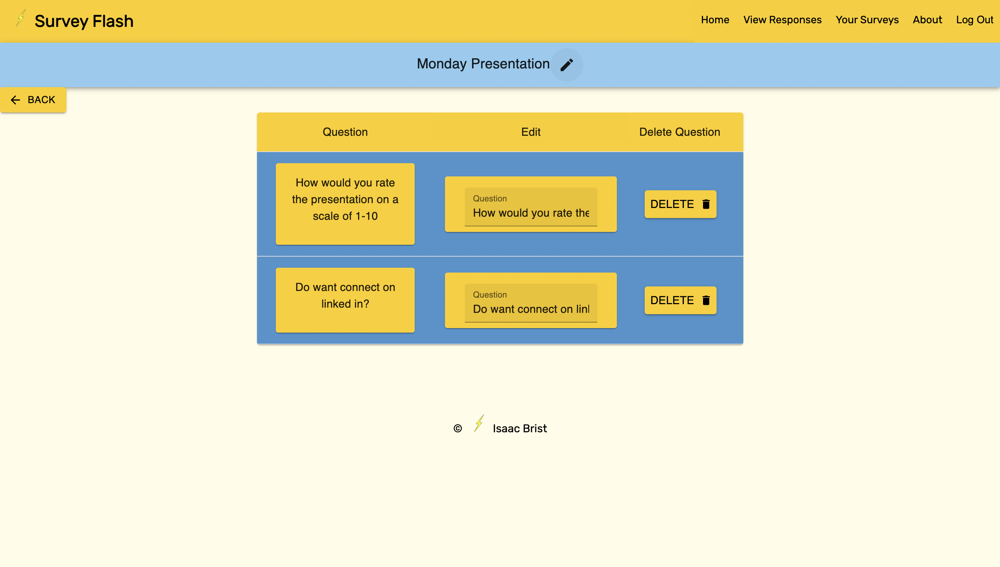
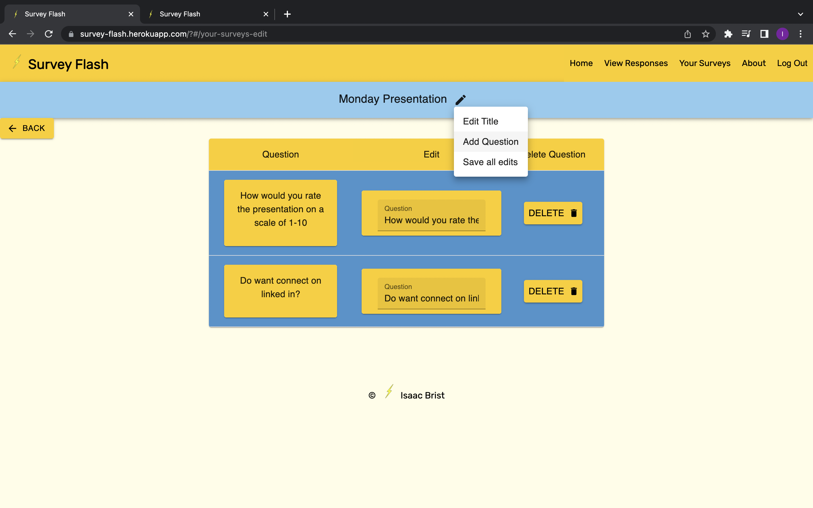
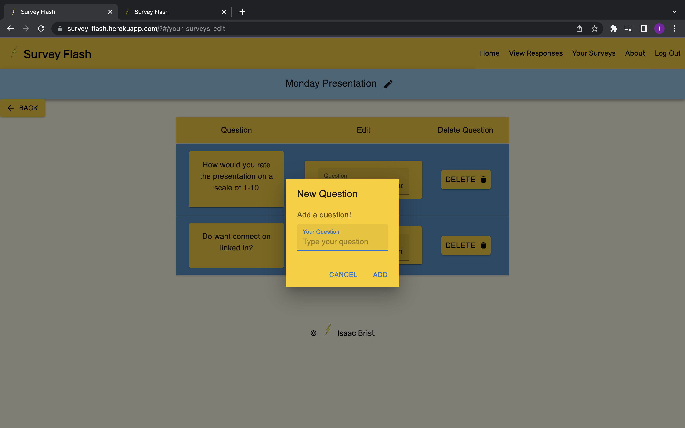
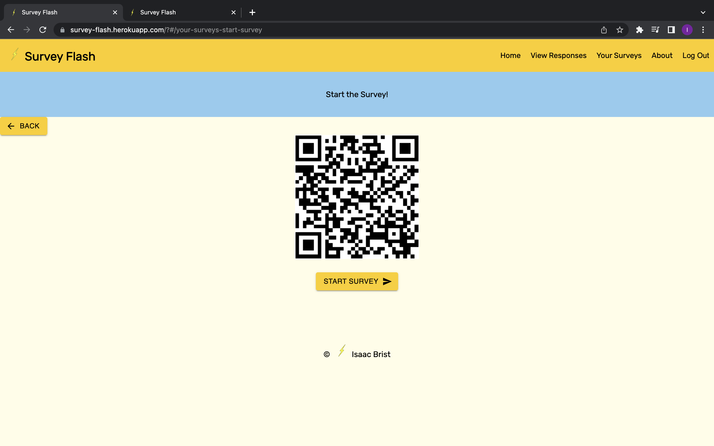
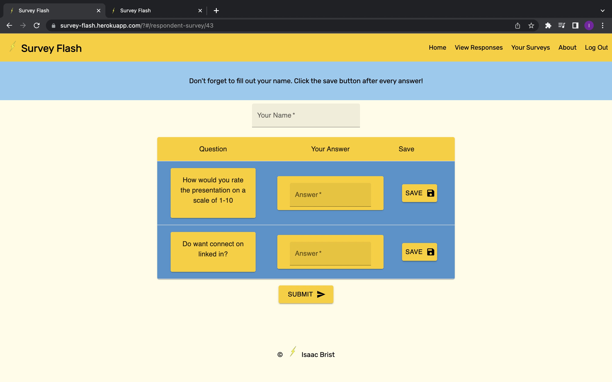
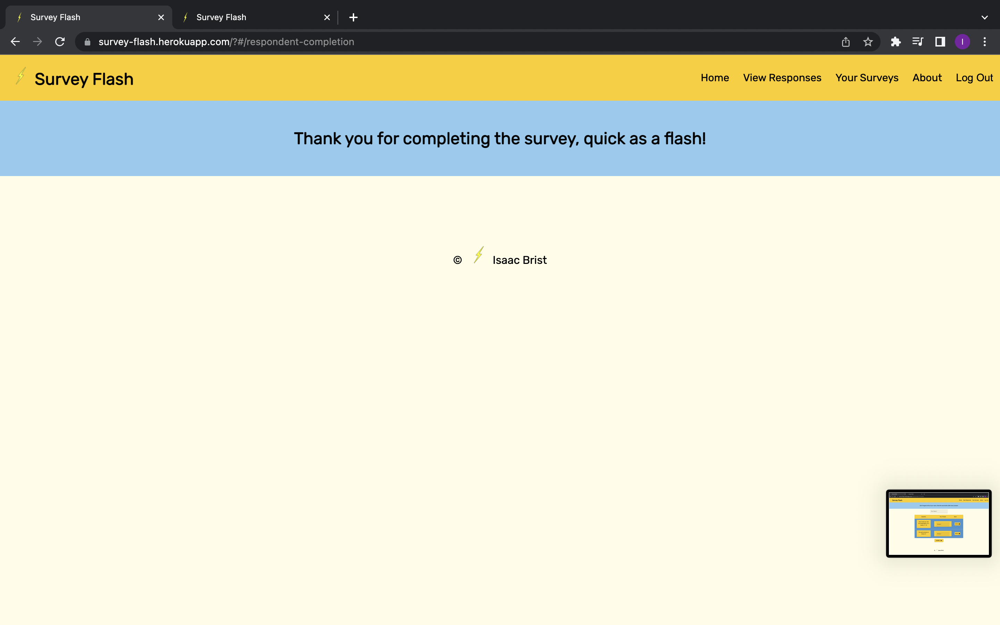
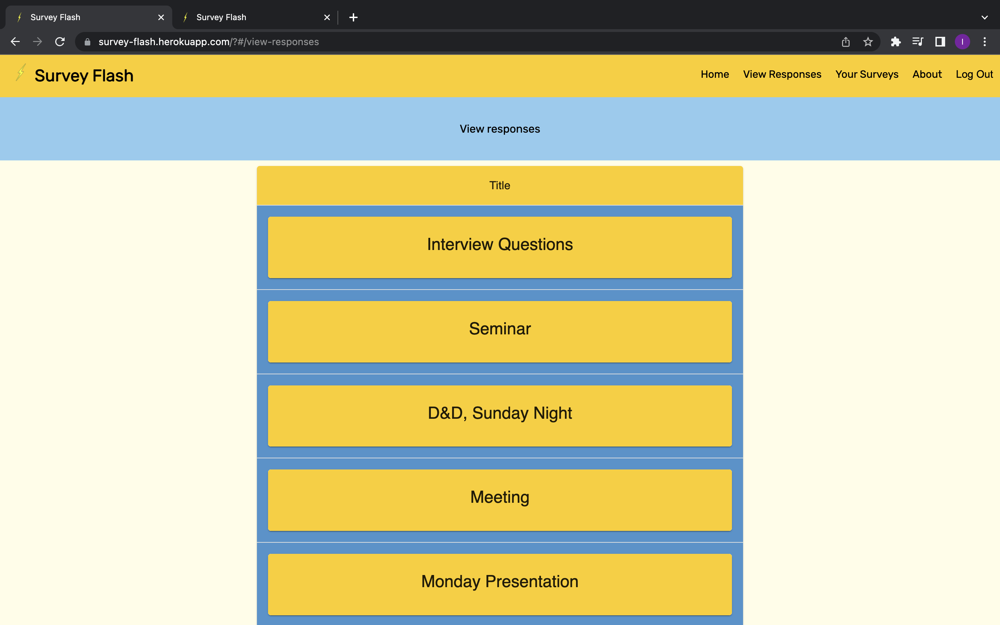
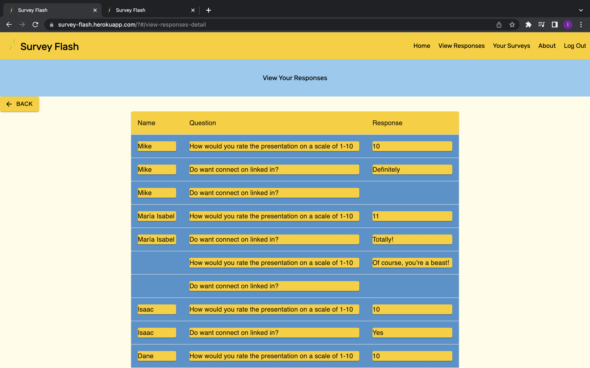
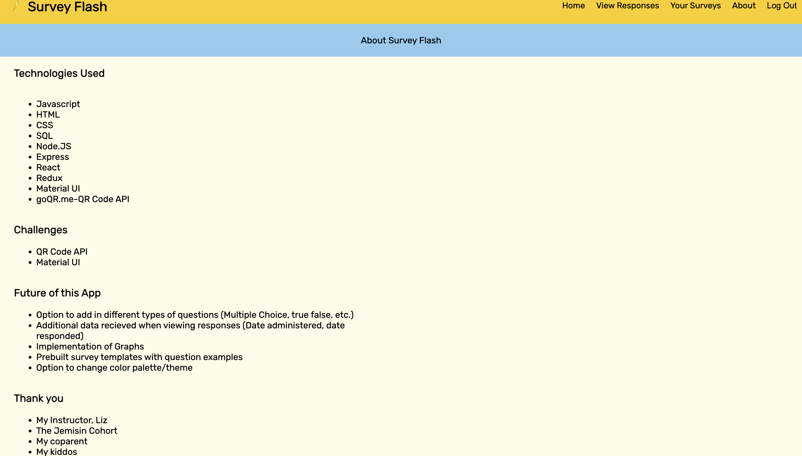

# Survey-Flash

## Table of Contents

- [Description](#description)
- [Screenshots](#screenshots)
- [Built With](#built-with)
- [Getting Started](#getting-started)
- [Usage](#usage)
- [License](#license)
- [Acknowledgements](#acknowledgements)
- [Contacts](#contacts)

## Description

--2 Week Sprint--

Have you ever led a meeting, given a seminar, or played in a D&D session and questioned whether anyone was listening to you or you wanted to get some feedback immediately? This is where Survey Flash excels-it allows you to quickly create and send surveys so that you can obtain the data that you need.

## Screenshots

## Built With

## Getting Started
Either go to the deployed app here: https://survey-flash.herokuapp.com/?#/home
OR download the project to get started.
1. Make sure to have a sql GUI like postico.
2. Set up your sql database using the queries in the 'database.sql' file.
3. Make sure to 'npm install'. Then run the command, 'npm run client' and 'npm run server' in your code editor's terminal.

## Usage

1. Register as a user and login.
2. On the home screen, navigate to the Your Surveys page using the nav bar in the top right. 
3. Here you can add a new survey, start administering the survey, and delete a survey. Create a new survey and click on the name to start editing it. 
4. On the Edit screen, there is an icon next to the name of the survey that can be clicked and has a drop down menu. This allows a user to add a question, edit the name of the survey, and save all edits. A user can edit the individual questions. 
5. On the Your Survey Page, you can click the Start Survey button to be brought to the Start Survey page. 
6. Here, the user can show the QR code to the people (responders) taking the survey and they will be brought to a page with all of the questions related to that survey. There is also a button so that the user can answer the survey themselves if they wish.
7. The responders will be taken to a page showing the corresponding questions. They can fill out their name. After typing in their answer to one question, they should click the Save button before starting tro type the next question. Once they have finished answering the questions, they can click submit. They will then be brought to a completion page, thanking them for completing the survey. 
8. Once a survey has been completed, a user can navigate to the View Responses page via the nav bar at the top right. 
9. Here the user can view all of their currently created surveys. They can click on the name of the survey to view the individual responses for that survey.
10. After the user is satisfied with the responses to the individual survey, they can navigate to the About page using the nave bar in the top right.
11. Here the user can learn more about the app and about the creator. A QR code is also displayed, which will connect the user to the creator's Linked In. 
12. I hope you enjoy!!

## Challenges

1. Material UI was a challenge to perfect the desired styling.
2. The dynamic and flexible nature of the survey questions/responses was challenging to code. 
3. The QR code API was challenging to implement. 

## Future of this Application

1.  Option to add in different types of questions (Multiple Choice,
true false, etc.)

2. Additional data recieved when viewing responses (Date
administered, date responded)

3. Implementation of Graphs

4.  Prebuilt survey templates with question examples
5. Option to change color palette/theme

## License

<a href="https://choosealicense.com/licenses/mit/">MIT License</a>

## Acknowledgements

Thanks to Prime Digital Academy who equipped and helped me to make this application a reality. Thanks to my instructor, Liz. Also, my undying thanks and gratitude to my classmates in the Jemisin cohort for their generosity and support. And lastly, thanks to my coparent and my kiddos!

## Contacts

 
